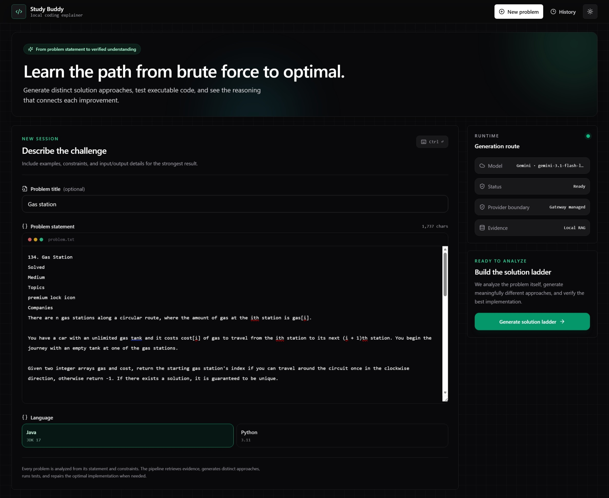
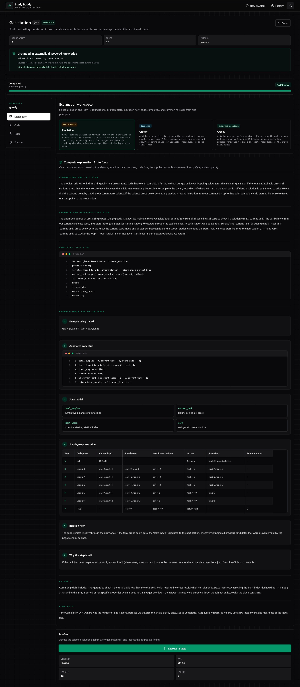
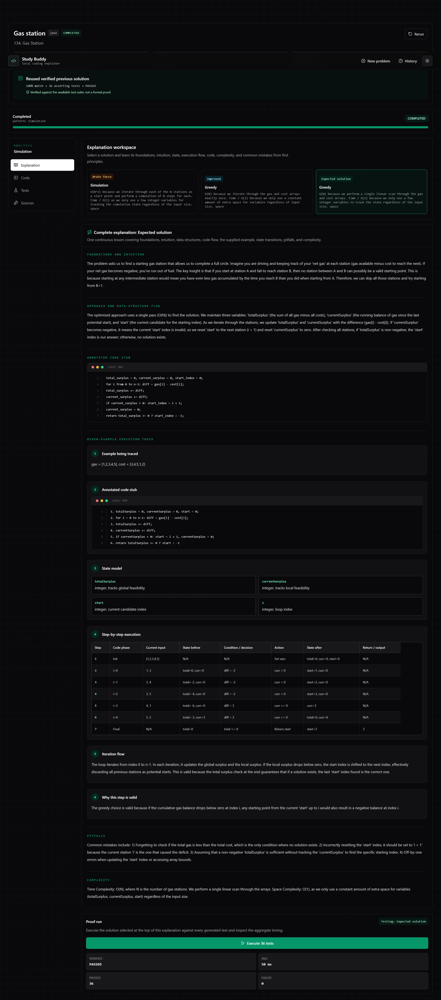
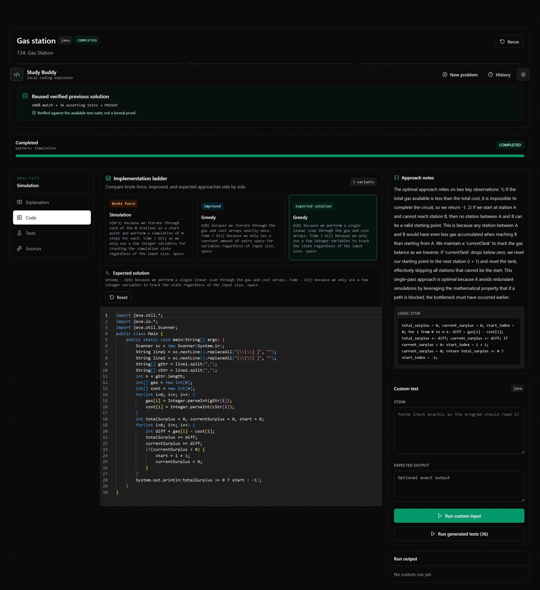
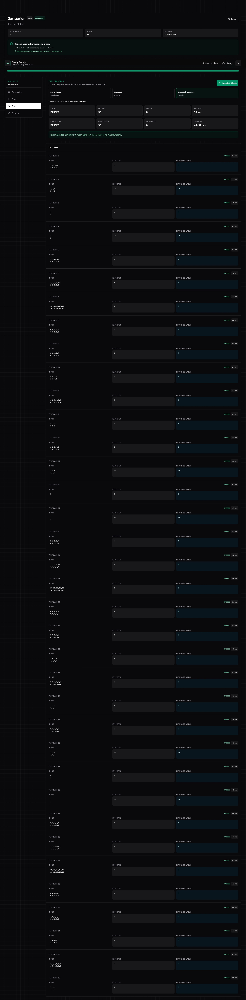
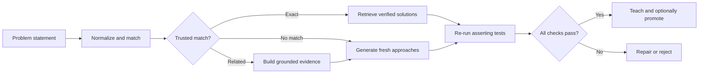
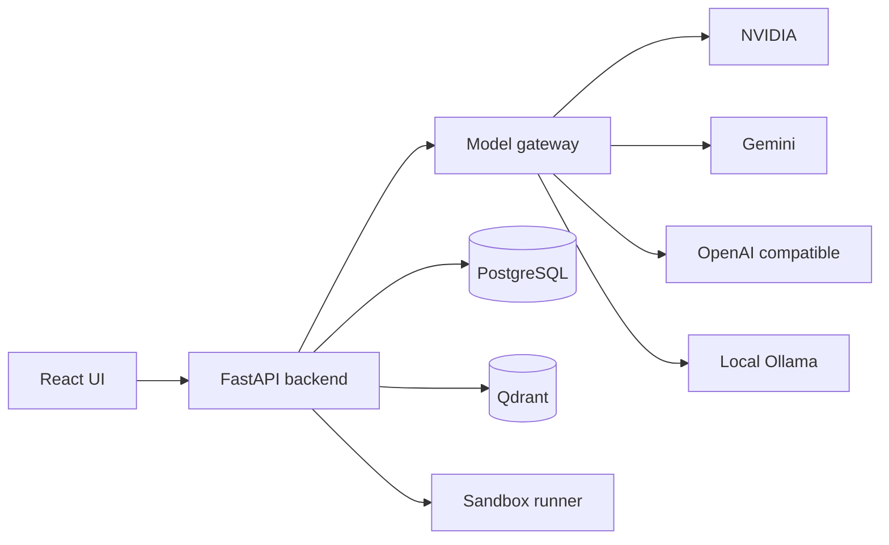

# CodingHelper

> From a problem statement to a verified understanding — not just another generated answer.

CodingHelper is an AI-assisted coding explainer for people who want to understand **how a solution evolves**, **why it works**, and **what the code is doing at every step**.

Paste a programming or DSA problem and CodingHelper builds a learning path from brute force to improved and optimal approaches. Each implementation is executable, checked in an isolated sandbox, and paired with a beginner-friendly explanation, state model, dry run, complexity analysis, and test-by-test output.



## The idea

Most coding assistants are optimized to produce an answer quickly. That is useful — until the learner is left with code they cannot explain, debug, or reproduce in an interview.

CodingHelper is built around a different question:

**Can an AI coding tool help someone understand the path to the answer, not only reveal the answer?**

The result is a workspace that treats every problem as a small lesson:

1. Understand the statement and constraints.
2. Retrieve relevant algorithm knowledge and previously verified material.
3. Generate meaningfully different solution approaches.
4. Execute every displayed implementation against an asserting test suite.
5. Explain the intuition, state, control flow, and trade-offs from first principles.
6. Show the actual returned value and runtime for every test case.
7. Reuse trusted solutions when the same problem appears again — while verifying them again.

## What the learner receives

### A solution ladder, not a single code dump

CodingHelper presents distinct implementations side by side:

- **Brute force** establishes the most direct mental model.
- **Improved** shows which repeated work can be removed.
- **Expected solution** demonstrates the strongest verified approach produced for the problem.

Similar intuition is allowed when the implementation, data structure, state representation, or control flow is genuinely different. This makes the comparison useful instead of presenting three renamed copies of the same algorithm.



### An explanation designed for someone learning the topic

Each approach becomes a continuous lesson containing:

- foundations and prerequisite ideas;
- the central intuition;
- the data structures and state variables;
- an annotated logic stub;
- the supplied example traced through the algorithm;
- step-by-step state transitions;
- iteration, recursion, or call-and-return flow;
- why each important decision is valid;
- common mistakes and edge cases;
- time and space complexity, with the reason behind each bound.

The goal is not to decorate generated code with a paragraph. The goal is to help a learner follow the execution deeply enough to explain it in their own words.



### Readable, runnable implementations

Generated code is normalized before it is stored and displayed. Java imports, methods, loops, conditions, and statements are formatted into readable lines, while strings and `for (...)` headers are preserved correctly.

The code workspace also supports:

- switching between generated approaches;
- editing a selected implementation;
- running custom standard input;
- supplying an optional expected output;
- executing the complete generated test suite;
- inspecting stdout, stderr, status, and timing.



### Verification you can inspect

Every displayed approach is run independently. The Tests workspace lets the learner choose exactly which solution to execute and keeps aggregate metrics at the top.

For every test case, it displays:

- input;
- expected value;
- actual returned value;
- pass or fail status;
- individual runtime;
- error output when present.



> **Important:** “Verified” means the implementation passed the available bounded test suite. It is a strong engineering signal, not a formal proof of correctness.

### A reusable Pattern Library

Every completed problem exposes its detected algorithmic pattern as a learning path, not just a label. Open the **Pattern** tab—or select the pattern directly from the result header or History—to study:

- the mental model and signals that help identify the pattern;
- its core operations, data structures, and correctness invariant;
- a worked example and implementation checklist;
- complexity trade-offs, common pitfalls, and related patterns;
- the evidence and coding sources that grounded the lesson.

Pattern lessons are stored once under a normalized key. If a later solution uses the same pattern, CodingHelper links that job to the existing lesson instead of making another model request. This keeps repeat learning instant and reduces provider usage while preserving the original job that created the lesson.

## Retrieval-first, verification-gated learning

CodingHelper does not treat every model response as a new source of truth.

It maintains a local solution corpus backed by PostgreSQL and Qdrant. Incoming problems are normalized and matched against previously verified knowledge before fresh generation begins.



The retrieval routes are deliberately separated:

- `EXACT_REUSE` re-runs stored implementations against stored asserting tests.
- `EQUIVALENT_ADAPT` changes only language or I/O details, then verifies the adaptation.
- `RELATED_GROUNDING` uses related material for intuition, invariants, edge cases, and testing guidance.
- `EXTERNAL_DISCOVERY` uses approved adapters and treats retrieved code as untrusted until execution succeeds.
- `GENERATE_FRESH` builds new grounded approaches when reusable knowledge is unavailable.

Successful work enters the reusable corpus only when verification, source-policy, minimum-test, code-hash, and secret-scanning safeguards pass.


## Provider-neutral model orchestration

The application backend does not know whether generation comes from Gemini, NVIDIA-hosted models, OpenAI, an OpenAI-compatible API, or local Ollama.

All model interaction crosses a stable internal model-gateway API. LangChain owns provider-specific integration inside that gateway, and provider selection happens through environment variables.



Changing providers does not require changes to the pipeline, database, frontend, or explanation logic. Each provider keeps its own model, credential, JSON-model, and endpoint properties; `LLM_PROVIDER` selects the active block.

Example NVIDIA configuration:

```dotenv
LLM_PROVIDER=nvidia
NVIDIA_LLM_MODEL=nvidia/your-model-id
NVIDIA_LLM_JSON_MODEL=
NVIDIA_LLM_API_KEY=your_nvidia_api_key
NVIDIA_LLM_BASE_URL=https://integrate.api.nvidia.com/v1
```

Example local Ollama configuration:

```dotenv
LLM_PROVIDER=ollama
OLLAMA_LLM_MODEL=qwen2.5-coder:7b
OLLAMA_LLM_JSON_MODEL=
OLLAMA_LLM_BASE_URL=http://ollama:11434
```

After changing provider settings, restart only the gateway:

```powershell
docker compose restart model-gateway
```

Credentials remain inside the model-gateway container and are not included in frontend bundles or normal application responses.

## Architecture

CodingHelper runs as a modular Docker Compose application:

| Service | Responsibility |
| --- | --- |
| `frontend` | React, Vite, TypeScript, Tailwind learning workspace |
| `backend` | FastAPI orchestration, RAG, persistence, and job lifecycle |
| `model-gateway` | LangChain provider adapters and structured model output |
| `postgres` | Application state, canonical problems, solutions, tests, and provenance |
| `qdrant` | Semantic indexes referencing authoritative PostgreSQL records |
| `sandbox-runner` | Isolated Java and Python compilation and execution |
| `ollama` | Optional local model service enabled through its Compose profile |

PostgreSQL is the source of truth. Qdrant stores embeddings and stable record identifiers. Generated code runs only in the sandbox service.

## Quick start

### Requirements

- Docker Desktop with Docker Compose
- An API key for a configured hosted provider, or a local Ollama setup
- Enough local resources for the selected model and services

### Run the application

```powershell
cd "D:\Development\study buddy"
Copy-Item .env.example .env
# Add the credential and model for your selected provider.
docker compose up --build
```

Open [http://localhost:5173](http://localhost:5173).

Useful endpoints:

- Frontend: `http://localhost:5173`
- Backend health: `http://localhost:8000/api/health`
- Sandbox health: `http://localhost:8100/health`
- Qdrant: `http://localhost:6333`

The model gateway is internal at `http://model-gateway:8300`. Its readiness is surfaced through the backend health response.

### Common development commands

```powershell
docker compose up -d --build
docker compose logs -f backend model-gateway sandbox-runner
docker compose restart frontend backend model-gateway sandbox-runner
docker compose down
```

Persistent state and caches live under `./data`; service logs live under `./logs/<service>/`.

## Who this is for

CodingHelper is useful for:

- learners moving from syntax knowledge to algorithmic reasoning;
- interview preparation where explaining trade-offs matters as much as coding;
- educators who want a structured walkthrough of multiple approaches;
- developers comparing model providers without coupling an application to one vendor;
- anyone who wants generated code to be executable and inspectable before trusting it.

## Current boundaries

- Passing tests does not guarantee correctness for every possible input.
- Explanation quality depends on the selected model and the available evidence.
- Generated and retrieved code remains untrusted until sandbox verification passes.
- Java and Python are the currently supported execution languages.
- LeetCode and other paid-platform scraping is not supported.
- External discovery is policy-controlled and can be disabled without disabling local reuse.
- Local models may require significant RAM, VRAM, and startup time.

## The short version

CodingHelper turns this:

> “Here is the optimal code.”

into this:

> “Here is the direct approach, what makes it slow, how the improved idea removes repeated work, how the optimal state evolves on the supplied example, what every important line does, and the returned value and runtime from every test we executed.”

That difference is the product.

---

## Instagram-ready caption

**I built an AI coding explainer that tries to teach the path — not just generate the final answer.**

CodingHelper takes a DSA problem and turns it into a complete learning workspace:

- → brute-force, improved, and optimal approaches
- → beginner-first intuition and data-structure fundamentals
- → an annotated code stub and supplied-example dry run
- → step-by-step state transitions
- → runnable Java or Python code
- → sandbox verification for every approach
- → actual returned values and runtime for every test
→ retrieval of previously verified solutions when a problem returns

The model layer is provider-neutral through LangChain, so the same application can use NVIDIA-hosted models, Gemini, OpenAI-compatible APIs, or local Ollama through environment configuration.

It is still important to be precise: passing a bounded test suite is not a formal proof. But making generation inspectable, executable, and easier to understand feels like a meaningful step toward more useful learning tools.

Built with React, FastAPI, LangChain, PostgreSQL, Qdrant, Docker, and an isolated code runner.

What would you want an AI tutor to explain before showing you the optimal solution?

`#BuildInPublic #AI #GenerativeAI #EdTech #Programming #DSA #LangChain #RAG #SoftwareEngineering #DeveloperTools`
