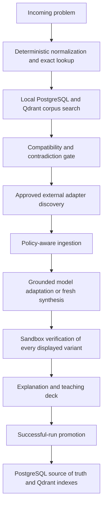

# Study Buddy Programming Explainer

Study Buddy is a programming explanation assistant. It accepts a programming or DSA problem, builds a grounded evidence pack, generates solutions through a provider-neutral model gateway, verifies code in a sandbox, and displays an interactive explanation.

## Architecture

The default project runs as seven Docker Compose services, with Ollama available as an optional eighth service:

- `frontend`: React, Vite, TypeScript, Tailwind UI
- `backend`: provider-neutral FastAPI orchestration, persistence, and RAG modules
- `model-gateway`: stable internal `/health` and `/generate` API with provider adapters
- `postgres`: relational state for jobs, results, metadata, history
- `qdrant`: vector database for source chunks and semantic retrieval
- `sandbox-runner`: isolated Python and Java code execution
- `ollama` (optional): local GGUF model serving when the gateway is configured for Ollama

PostgreSQL is the application source of truth. Qdrant stores embeddings. The backend orchestrates jobs but has no Gemini/Ollama knowledge; all LLM calls cross the model-gateway API. Generated code only runs in `sandbox-runner`.

## Local Data And Live Code Mounts

All persistent container data is directed into `./data`:

- `data/postgres`: PostgreSQL cluster data
- `data/qdrant`: Qdrant vector storage
- `data/backend/artifacts`: backend generated artifacts
- `data/backend/model-cache`: local model files
- `data/backend/source-cache`: source cache
- `data/ollama`: persistent Ollama model store
- `data/frontend/node_modules` and `data/frontend/npm-cache`: frontend dependency/runtime cache
- `data/sandbox-runner/work`: temporary generated-code execution work area, cleaned per run

The code for `frontend`, `backend`, `model-gateway`, and `sandbox-runner` is bind-mounted into their containers. Python services run with reload enabled.

## Quick Start

```powershell
cd "D:\Development\study buddy"
copy .env.example .env
docker compose up --build
```

After the first build, code changes can usually be picked up with:

```powershell
docker compose restart backend
docker compose restart model-gateway
docker compose restart sandbox-runner
docker compose restart frontend
```

Open:

- Frontend: http://localhost:5173
- Backend health: http://localhost:8000/api/health
- Model gateway: internal-only at `http://model-gateway:8300`; inspect readiness through backend `/api/health`
- Sandbox health: http://localhost:8100/health
- Qdrant: http://localhost:6333

## Developer Commands

```powershell
make up
make down
make logs
make migrate
make test-backend
make test-sandbox
```

On Windows without `make`, run the equivalent Docker Compose commands from the `Makefile`.

## Logging

Every service writes logs to the console and to `./logs/<service>/` on the host:

- `logs/frontend/frontend.log`
- `logs/backend/backend.log`
- `logs/backend/backend-console.log`
- `logs/ollama/ollama.log`
- `logs/postgres/postgres.log`
- `logs/qdrant/qdrant.log`
- `logs/sandbox-runner/sandbox-runner.log`
- `logs/sandbox-runner/sandbox-runner-console.log`

File logs rotate at `LOG_MAX_BYTES=10485760` and keep `LOG_MAX_FILES=10` files total by default. Docker console logs are also capped at 10 files of 10 MB per service.

Set `VERBOSE_LOGGING=true` in `.env` before starting Compose to enable debug-level app logs and more detailed service output. PostgreSQL and Qdrant can be tuned further with `POSTGRES_LOG_*` and `QDRANT_LOG_LEVEL` in `.env`.

## Model Gateway

The application talks only to `MODEL_GATEWAY_URL`. Provider selection, credentials, model names, retries, and provider-specific HTTP formats belong exclusively to `model-gateway`.

For NVIDIA hosted models, configure `.env`:

```dotenv
LLM_PROVIDER=nvidia
NVIDIA_LLM_MODEL=nvidia/your-model-id
NVIDIA_LLM_JSON_MODEL=
NVIDIA_LLM_API_KEY=your_nvidia_api_key
NVIDIA_LLM_BASE_URL=https://integrate.api.nvidia.com/v1
```

Provider interaction is implemented with LangChain. Supported values are `nvidia`, `gemini`, `ollama`, `openai`, and `openai_compatible`. Switching to a local Ollama model requires only environment changes:

```dotenv
LLM_PROVIDER=ollama
OLLAMA_LLM_MODEL=qwen2.5-coder:7b
OLLAMA_LLM_JSON_MODEL=
OLLAMA_LLM_BASE_URL=http://ollama:11434
```

Restart only the gateway after changing providers or keys:

```powershell
docker compose restart model-gateway
```

Each provider keeps its own model, JSON model, credential, and endpoint values. The gateway reads only the block selected by `LLM_PROVIDER`, so switching providers does not require rewriting or losing the previous provider's configuration. Credentials are available only to the gateway container and are never included in the frontend bundle or normal API responses. LangChain owns provider-specific SDK behavior inside the gateway; the application backend, pipeline, and frontend contract remain unchanged.

The backend intentionally stays online when the model gateway is degraded. `/api/health` reports model readiness, while history and other non-generation features continue working. Provider failures therefore appear as explicit job/gateway errors instead of browser-level `Failed to fetch` messages.

The frontend sends `/api` requests to its own origin and Vite proxies them internally to `backend:8000`. This avoids browser coupling to `localhost:8000` and works when the UI is opened from another device on the network.

The solution ladder is generated as separate structured requests for brute-force, optional improved, and optimal implementations. This prevents a truncated combined response from silently producing only one approach.

The job pipeline calls the configured model runtime for solution generation, test generation, explanation generation, and slide markdown generation. If the model cannot load or returns malformed structured output, the job is marked failed instead of silently using a deterministic placeholder.

## Retrieval Knowledge Base

Study Buddy uses a retrieval-first, verification-gated corpus. PostgreSQL owns complete canonical problems, variants, reusable implementations, asserting tests, provenance, compliance metadata, and verification records. Qdrant contains embeddings plus stable PostgreSQL IDs; its payloads are never authoritative content.



Retrieval routes are deliberately distinct:

- `EXACT_REUSE`: re-run a verified implementation and stored asserting tests without fresh algorithm generation.
- `EQUIVALENT_ADAPT`: adapt only language or I/O differences, then verify before reuse.
- `RELATED_GROUNDING`: use related knowledge only for intuition, invariants, tests, and pitfalls.
- `EXTERNAL_DISCOVERY`: query approved adapters; retrieved code remains untrusted until sandbox verification.
- `GENERATE_FRESH`: use the existing grounded generation path when no reusable match exists.

Stack Exchange uses its official API, Codeforces uses official metadata only, curated repository discovery is allowlist-only, and user URLs are protected against SSRF, internal redirects, oversized responses, and unsupported content types. Automated LeetCode crawling and search-result-page scraping remain disabled.

A successful run is promoted only when at least `RAG_MIN_ASSERTING_TESTS` tests have expected outputs, every promoted code hash matches an independently passing sandbox verification, no timeout/failure occurred, and source policy plus secret scanning pass. “Verified” means verified against the available bounded test suite, not formally proven correct.

Disable network discovery without disabling local reuse:

```dotenv
RAG_EXTERNAL_DISCOVERY_ENABLED=false
```

Backfill historical successful jobs and reconcile vector indexes safely:

```powershell
docker compose exec backend python -m app.rag.backfill_verified_corpus --dry-run
docker compose exec backend python -m app.rag.backfill_verified_corpus --limit 100
docker compose exec backend python -m app.rag.reconcile_qdrant --dry-run
docker compose exec backend python -m app.rag.reconcile_qdrant
```

The app should not depend on the user providing URLs. Optional user URLs are accepted, but automatic retrieval starts from curated, approved sources:

- CP-Algorithms
- The Algorithms GitHub organization
- Official Python documentation
- Official Java documentation
- Stack Exchange and Codeforces APIs where adapters are implemented
- GeeksforGeeks only with the restricted snippet/citation policy

The retrieval layer should prefer open/cacheable sources and store only metadata/snippets for restricted sources.

## Project Working Guidelines

- Start every session by reading `PROJECT_MEMORY.md`.
- End every implementation session by updating `PROJECT_MEMORY.md`.
- Prefer the simplest understandable implementation that satisfies the requirement.
- Touch only files directly required for the change.
- Ask when a product, hardware, data, or behavior choice materially affects the result and cannot be discovered from project context.
- Do not invent unsupported technical choices; document selected defaults and the reason for them.

## Limitations

- The system does not guarantee correctness.
- Online sources improve grounding but do not prove correctness.
- Verification depends on available and generated tests.
- LeetCode or paid platform scraping is not supported.
- GeeksforGeeks is handled with restricted retrieval rules.
- Local model quality depends on the configured model.
- Large models may require GPU and significant RAM or VRAM.
